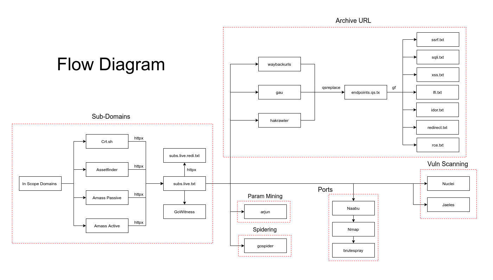

# Chains - Automate the Boring Recon

## Description

Automation for Small and Medium Scopes

```
➜  Chains git:(main) ✗ ./chains.sh Scope.txt Target.com
   ____ _           _             	 
  / ___| |__   __ _(_)_ __  ___   	 
 | |   | '_ \ / _` | | '_ \/ __|  	 
 | |___| | | | (_| | | | | \__ \_ 	 
  \____|_| |_|\__,_|_|_| |_|___(_) by A1MN.
                       		 	 
Output @ ~/Target.com
Select path ...
        [1] Subdomains & Spidering 
        [2] Waybackurls
        [3] Port scan 
        [4] Vulns Scan		
        [5] All 
        > 5
      
[+] Playing With Subdomains
    Crt.sh
    Assetfinder
    Subfinder
    Amass Enum Passive
    Amass Enum Active
    All Live Subs
    Final Destination
    GoWitness
    
[+] Spidering
    GoSpider					        
    Arjun

[+] Playing With URLs
    Waybackurls Pure
    Smart Endpoints
    Vulnerable URLs

[+] Playing With Ports
    Naabu and Nmap
    Nmap Read
    Nmap Grep
    BruteSpray ...
    BruteSpray-Output

[+] Nuclei
    Nuclei Summary  

[+] Jaeles
    Jaeles Summary  
```


## Installation

Install **golang** first ..

```
@ sudo ./setup.sh
```

## How to use

```
$ ./chains scope.txt out_folder
```

you will find out folder in your home directory

## Tools

GoLang tools are Amazing ...

1. Assetfinder
2. Amass
3. Crt.sh
4. Httpx
5. GoWitness
6. Waybackurl
7. Gau
8. Hakrawler
9. Qsreplace
10. GF
11. Arjun
12. GoSpider
13. Naabu
14. Nmap
15. BruteSpray
16. Nuclie
17. Cent
18. Jaeles

## Flow



